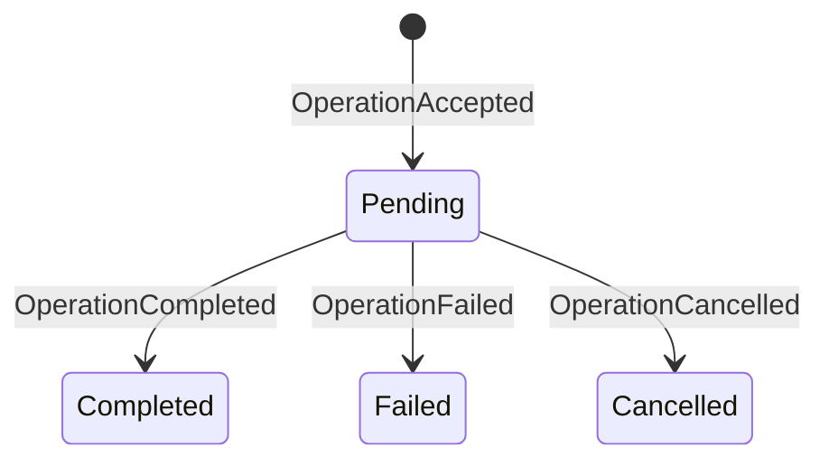

# Durability model

Nanocodex uses one fenced store protocol for durable execution. Rust owns each
agent's execution head and immutable records; hosts persist them atomically.
Child registries, session documents, and host effect journals retain their own
facts at explicit admission and settlement boundaries. Application projections
do not decide whether an interrupted effect may execute again.

The protocol protects the entire execution lifecycle: prompt admission, model
requests, warmup, compaction, tool effects, checkpoint commits, cancellation,
terminal results, and recovery. It is not a tool-only mechanism.

## Cloudflare execution lifetime

Managed and managed2 enable `durable_object_io_tasks_prevent_eviction` while
keeping their existing compatibility dates. Pending service-binding requests,
DO RPC, `ctx.waitUntil()` promises, and timers protect live execution from idle
eviction after the client disconnects. Each operation protects at most its first
15 minutes; operations started later can extend residency. A single unresolved
turn promise is not an unlimited execution lease. Protected residency incurs
normal duration charges, so completed operations must release their timers.

Persisted turn state, effect receipts, and recovery alarms remain necessary for
process loss and deployments. The existing 60-second managed and 10-second
managed2 recovery schedules are unchanged; they determine recovery latency,
not whether a healthy operation can continue without its client.

The workspace pins workerd to a version that recognizes this compatibility
flag. Run the hosted disconnected-client journey with
`pnpm --filter nanocodex-managed-service run test:pending-io:live`. It uses
Wrangler authorization to deploy a temporary workers.dev Worker, leaves the
client disconnected for 160 seconds across service fetch, DO RPC, and timer
waits, then deletes the Worker. Receipts and deployment/cleanup logs are saved
in a unique directory under `output/pending-io/`. This is a live test: local
workerd did not preserve residency in the same long-wait journey and is not
used as evidence of hosted eviction protection. Run `test:recovery` separately
for process-loss recovery.

See [Cloudflare's lifecycle contract](https://developers.cloudflare.com/durable-objects/concepts/durable-object-lifecycle/).

## Local CLI crash testing

The headless CLI can attach the real portable durability engine to a local
SQLite file for destructive testing:

```console
nanocodex run \
  --local-durability /tmp/nanocodex-durability.sqlite \
  --local-durability-state-id hammer-root \
  --request-id turn-1 \
  --rollouts false \
  "exercise the durable agent"
```

Re-running the exact command reopens `hammer-root` and replays the terminal
receipt for `turn-1` without dispatching its effects again. Reuse the database
and state ID with a new request ID to submit a follow-on turn. Clean spawned
agents use the same database but persist under their own UUIDv7 session IDs.

This flag is deliberately limited to `nanocodex run`. It refuses rollouts so
SQLite remains the only restart authority, and one explicit request ID cannot
be combined with `--repeat` greater than one. Use SIGKILL to test process loss;
SIGINT and SIGTERM exercise the CLI's graceful cancellation path.

For managed lifecycle testing, `nanocodex managed-server` exposes the
REST, resumable SSE, and `/tool-host` lifecycle subset consumed by
`nanocodex2`, on a literal loopback address only:

```console
nanocodex managed-server \
  --sqlite /tmp/nanocodex-managed.sqlite \
  --workspace "$PWD" \
  --openai-api-key "$OPENAI_API_KEY" \
  --bearer 'ncx_live_<testing-id>_<testing-secret>'
```

The SQLite file holds both the opaque per-agent durability states and a small
managed projection for agent identity, idempotent turn receipts, terminals,
and event cursors. This permits real `nanocodex2` create, run, steer, cancel,
client detach/reconnect, cold server recovery, and concurrent same-key
admission exercises.

The loopback server has one static testing principal. Its `/tool-host` support
covers catalog acknowledgement, socket replacement, heartbeat, drain, and
reconnect, but it does not route reverse-attached tool calls. It also does not
implement the advertised `/ws` command socket. Steer delivery is live: once a
later model boundary is committed the steer is in the durable checkpoint, but
a server crash between the steer receipt and that boundary may lose it. Use the
Cloudflare managed tests for account/grant isolation and full reverse-tool
routing. This command is a durability fault harness, not another managed
backend.

## Authority

| Layer | Durable responsibility | Never authoritative for |
|---|---|---|
| `nanocodex-durability` | Total state format, FIFO admission, effect recovery, checkpoints, terminals | Provider or application policy |
| State store | Atomic owner acquisition and compare-and-replace of one opaque value | State decoding or recovery decisions |
| Agent adapter | Stable IDs and typed inputs/outputs for model, compaction, warmup, and tool steps | Storage semantics |
| Managed Durable Object | Inbox, cancellation intent, retry deadline, terminal/event projection | Whether an inner effect may replay |

There is no second durable attempt state. A driver owns live operation claims
and running attempts in memory under its fenced owner capability. Losing the
driver loses those claims; it does not require a state mutation to release
them.

## Agent identity and child ownership

A child has a stable tree ID, native session ID, parent, assignment revision,
and foreground or background lifetime. `ChildJournal` persists topology,
mailboxes, execution admission, cancellation intent, and results using the
existing fenced store. Large values use immutable records; the current head
contains a bounded root reference.

Hosted agents with durability configure a separate native `DurableSession` for
each child and reconstruct the registry before returning replayed capabilities.
A completed spawn receipt therefore refers to the original child. Root and child
owners remain separate, and reconstruction uses the current host's authorization.
Saved tool context does not grant new authority.

On native targets, `nanocodex::DurableAgentExt` (the facade's `durability`
feature) installs the registry, same-family child factory, per-child execution
journals, and foreground ownership barrier. OpenAI builders are supported;
Claude builders also require the facade's `claude` feature. Caller tools and
tool-factory recipes are retained. Automatic recipes do not switch between
OpenAI and Claude; an embedding must supply explicit authorized recipes for that
routing. Successful root completion waits for foreground children; failure or
cancellation stops foreground children before settlement.
An already configured spawn factory is rejected before identity or child-tree
mutation; embeddings with custom routing can attach the core
`nanocodex_durability::DurableAgentExt` adapter and supply their own durable child
factory and registry. Copying the parent's execution policy into a child is not
supported. On WASM, the facade reexports the core adapter; JavaScript hosts
compose their own durable child registry and factory.

Native facade builds begin owner-bound reconstruction immediately, including
pending background work when the root operation already completed. Await
`agent.ready()` to observe startup completion or its retained recovery error; no
root prompt or operation is fabricated. New prompts also await readiness.
Shutdown and dropping the last handle cancel unfinished startup recovery.

Background children require a durable parent. Managed recovery alarms reopen
unfinished background work even after the parent turn has settled. Completed
children remain addressable without keeping an idle recovery loop running.
Explicit subtree close records cancellation before stopping native drivers.

## Session documents and forks

Session documents belong to an agent's execution state. Receipt/checkpoint and
document mutations can commit in one replacement with expected document versions.
A rejected transaction changes neither. Account-wide app and user-data stores
remain separate shared records and do not implicitly join this transaction.

Fork policies select the creation value (`Initial`), latest value (`Current`),
value at the selected successful operation (`AsOf`), or refuse the fork (`Block`).
The source boundary includes its checkpoint. Immutable operation lookup records
survive terminal receipt pruning, and destination initialization rejects an
already occupied state. Historical forks use the original boundary rather than
reinterpreting the current transcript. Reusing a retained historical operation ID
is rejected even after its ordinary terminal receipt has expired.

A document fork seeds a new session's checkpoint and selected documents, not its
source's operation receipts, pending effects, or child tree. For OpenAI's paged
context, use `DurableSession::agent_document_fork` and
`initialize_agent_document_fork`; these materialize and reindex the checkpoint
in the destination store. Claude's native checkpoint uses `document_fork` and
`initialize_document_fork`. Construct the destination with its own durable owner
and current tools and credentials. These APIs are distinct from native
`Nanocodex::fork`/`fork_from`: OpenAI rejects those history operations when an
execution policy is installed, and Claude does not implement them.

## Store contract

The live store protocol implements three operations:

1. `acquire(state_id, owner_id)` atomically advances the owner fence and
   returns the new token with one coherent state value.
2. `read_record(state_id, key)` loads one immutable record; the optional batch
   implementation reads up to 16 records per storage call.
3. `replace(state_id, owner_token, expected_revision, payload, records)` first checks
   the owner token, then the expected revision, and atomically replaces the old
   opaque Rust head and publishes every new record in the same transaction.

There is exactly zero or one execution head and an immutable record table. Receipt retention is a normal state transition,
not log-prefix compaction. Hosts never deserialize state.

With bounded receipt retention, terminal operations retain their exact input,
checkpoint, and result, but discard intermediate step and steer payloads. These
payloads are recovery scratch data and cannot be used after settlement. Pending
agent operations retain one current conversation and execution phase, plus only
the current batch of effect records. A single replacement saves the next
conversation and retires settled effects; advancing past an unfinished effect is
rejected unless it is explicitly retained background work. The immutable summary
cutoff and its pending or completed receipt survive foreground advances. Recovery
resumes this batch, with original request settings and token
usage, without replaying earlier batches or storing historical request copies. Encoded payloads share immutable storage
inside the Rust owner so preparing a replacement does not deep-copy every receipt.
Managed sessions keep 16 inner terminal receipts; their managed inbox and archive
continue to own public exact-ID replay beyond that tail.

State format 5 uses the `nanocodex_durable_state` head envelope and SHA-256
addressed payload records. Bodies over 256,000 UTF-8 bytes are split into records.
OpenAI checkpoints use persistent 64-message context pages that share prior
records. Each boundary publishes only new messages and changed pages, with its
head in one atomic transaction. Claude checkpoints retain native Messages
content, including signed thinking and tool results, in chunked payloads;
serialization and restoration still process the full retained Claude context.
Format 4 heads remain readable; missing tool replay permission is unsafe.
The old inline/compressed storage formats are rejected.

Cold acquisition reads the head only. Execution resolves current model context
and active effects in batches of at most 16 records. Current-context hashes are
primed on recovery so continuing an old thread does not rewrite old messages.
Resident memory is O(current model context + active tool working memory + bounded
I/O); historical storage grows with completed work. No turn duration or step
count cap is imposed. Arbitrary allocations inside user tools are outside this
bound and belong on an appropriate execution host.

Model event reads have no silence deadline: a reasoning call can remain quiet
without being failed or replayed. Rust owns cancellation and releases the
connection when the response is dropped. Native HTTP, native WebSocket, and
WASM hosts follow the same rule. Connection setup and sends retain their own
deadlines; explicit connection failures still enter normal recovery.

A run terminal is emitted only after settlement and recovery classification.
An interrupted attempt classified as retry or reopen emits no `run.failed` or
`run.completed`. A later attempt or exact receipt replay emits the committed
terminal. Otherwise a streaming consumer can exit on a failed attempt while its
server continues the same durable turn, disconnecting resources it still needs.
This rule belongs to the Rust driver, before any WASM or host event projection.

Terminal `duration_ns` and `duration_ms` measure the same logical operation as
the retained model and tool counters. Elapsed time starts when execution first
begins and includes interruption and recovery downtime. A persisted Unix-clock
origin carries elapsed time across runtime reconstruction; each live attempt
uses a monotonic clock. Model and tool counters can overlap or describe replayed
effects, so their sum is not an elapsed-time clock. Exact receipt replay returns
the committed result and usage without executing the operation again; its
synthetic terminal currently reports zero execution duration and counters.

Older execution continuations without a clock origin still recover with their
retained counters. Their elapsed basis starts at the first upgraded attempt;
pre-upgrade elapsed time cannot be reconstructed. Clock changes between attempts
can affect the recovered interval; a backwards interval is clamped to zero.

Run `node --test js/nanocodex/test/durability-timing.test.mjs` after building WASM
to exercise cold-process recovery through the public Agent API, real WebSockets,
SQLite persistence and a native marker effect. Set `NANOCODEX_TIMING_EVIDENCE` to
an ignored `output/` directory to retain commands, events, SQLite state and timing
summaries. Set `NANOCODEX_TIMING_LEGACY_WASM` to a pre-upgrade WASM binary to also
exercise recovery of a checkpoint written by that older runtime.

## Provider portability

The JavaScript memory, SQLite, Cloudflare Durable Object SQLite, and PostgreSQL
adapters also implement an offline transfer extension. `exportDurabilityState`
acquires a fresh owner fence at the source and returns one JSON-safe archive
containing the stable state ID, exact revision, execution head, and immutable records.
This full archive materializes all records; large histories use the asynchronous
paged export/import APIs. Pages stage immutable records before publishing the
head. Managed exports seal at most 16 records per R2 object and copy bounded
batches, with resumable progress in SQLite and the head published last.
`importDurabilityState` installs that exact revision into an empty destination
and creates a fence before any destination agent can acquire it.

The state ID is part of the agent's durable identity and must not be rewritten.
The storage provider and physical database may change; the logical agent ID
does not. This lets the same Rust/WASM agent move, for example, from a
Cloudflare Worker Durable Object to Vercel with PostgreSQL and back again.
Completed operation IDs still replay their committed terminal results without
calling the model, while newly accepted operations continue from the imported
checkpoint. The first new model request after rehydration carries the committed
history and does not depend on a provider-owned previous-response handle.

This is a cutover protocol, not live replication or a distributed transaction:

1. stop accepting work and shut down the source agent;
2. export once, which fences any stale source writer;
3. transfer the archive as sensitive application data;
4. import into an empty destination under the archive's unchanged state ID;
5. start the destination agent and never resume the old source.

Importing the same archive into multiple destinations creates competing clones;
only one destination may become live.

The Cloudflare adapter exposes this protocol directly as
`CloudflareAgent.exportDurabilityState(owner)` and
`CloudflareAgent.importDurabilityState(owner, archive)`. Export requires an
inactive Agent. Import requires a pristine Durable Object and is exactly
idempotent for a byte-identical archive, so a lost success response can be
retried. A fresh runtime session ID is created at the destination while the
archive's stable state ID remains unchanged. This archive represents one execution
state, not a task tree. Cloudflare rejects export (including head-only export)
when descendant execution journals are retained, even for closed children;
the rejection occurs before acquiring or fencing any owner. An empty registry
alone does not block export. `CloudflareAgent.destroy(owner)` requires an inactive
lifecycle and fences and deletes the root, registry, and descendant journals.

Managed Code Mode memo snapshots use an 8 MiB bound shared by their SQLite
journal and account-owned R2 document references. Forks copy the selected
snapshot into the new native session's journal; cold reopen retains branch
writes without changing the parent. Aggregate writes that exceed the bound
are rejected before committing the new journal state.

The managed portability archive does not carry that colocated journal or its
account-owned R2 objects. `POST /v1/agents/:id/durability` therefore returns
`409 code_mode_store_not_portable` for stored Code Mode state before sealing
the source. The source remains usable. Import rejects older pointer-only
Code Mode archives with the same error before creating a destination. Delete
clears the session's cells, store versions, blob metadata, and chunks along
with its other managed state.

Archives can contain conversation and tool state and are not encrypted by this
API. Applications own transport encryption, access control, retention, and
deletion. An unconfirmed destination commit must be reconciled by loading the
destination; blindly resuming the source can create split-brain execution.

Store results have exact meanings:

| Result | Meaning | Same-owner retry |
|---|---|---|
| success | Mutation committed at the returned revision | Not needed |
| `NotCommitted` | Store guarantees no mutation occurred | Allowed |
| `Fenced` / `Conflict` | This owner or revision is stale | Forbidden |
| backend/transport error | The commit is not proven | Forbidden; reacquire and reload |

## Total restart state

Every committed revision is independently decodable. It contains all retained
operations, each operation's full step states, the latest resumable checkpoint,
and committed step outputs. A stored revision never depends on an earlier
revision.

## Operation state

The durable operation state machine is intentionally small:



Acceptance stores the exact operation ID and typed input. A duplicate with the
same input returns the existing state; the same ID with different input is an
error. Pending operations execute FIFO. Completion and failure atomically carry
the new resumable checkpoint. Cancellation may carry a safe interrupted
checkpoint.

Attempt starts, releases, and transient failures are live scheduling facts,
not durable facts.

## Effect state

Every operation-owned external effect uses a stable step ID and records its
normalized input before dispatch. This includes:

- model generation;
- WebSocket warmup;
- automatic compaction;
- tool execution.

Beginning a step returns exactly one value:

| Admission | Durable evidence | Caller action |
|---|---|---|
| `Execute` | New intent, or both saved and current replay policies are safe | Dispatch and commit output |
| `Replay(output)` | A completed output is durable | Reuse the exact output; do not dispatch |
| `OutcomeUnknown` | Unsettled effect without both safe permissions | Reconcile or commit an explicit unknown-outcome result; do not redispatch |

Tool effects default to unsafe. Parallel execution permission is independent.
The policy is committed with intent, so an unsafe effect cannot become replayable
merely because a later deployment changes its handler. Conversely, removing a
safe permission suppresses replay. Completed receipts replay even when a handler
is unavailable. Native and Claude agent adapters settle unknown outcomes as
failed tool results so the model can continue with accurate evidence.

Model requests, warmup, compaction, and the host's explicitly idempotent
preservation barrier opt into replay. Provider usage may be billed again after
interruption. Bounded transport retries belong to the live provider attempt.
Effect settlement remains one atomic `effect_pending -> completed(output)`
replacement under the current owner fence.

Standalone compaction follows the same rule. A committed resulting checkpoint
replays; otherwise a later request runs compaction again. It cannot run while an
accepted operation is pending.

Each new standalone compaction gets a fresh candidate identity; automatic
admission can reclaim a matching pending compaction. Graceful interruption
commits cancellation and its checkpoint, and a committed failure is terminal.
A later prompt therefore cannot be stranded behind abandoned maintenance work.
An uncommitted or ambiguous replacement still requires recovery.

## Checkpoints and terminals

The checkpoint inside `OperationCompleted` or `OperationFailed` and that
operation's terminal result are one state replacement. A crash cannot expose a
new checkpoint without its terminal receipt or a terminal receipt without its
checkpoint.

Standalone developer-context and compaction boundaries use
`CheckpointCommitted`. They are rejected while an operation is pending, so a
standalone checkpoint cannot jump over FIFO work.

## Cancellation

Cancellation is durable intent at the application boundary and a terminal
state fact at the Rust boundary.

Managed cancellation may reserve an exact not-yet-admitted turn ID. Matching
admission consumes that reservation into `cancelling` before any model or tool
work starts. Active cancellation commits `OperationCancelled` before the API
reports completion. A definite `NotCommitted` may retry; an unconfirmed store
commit requires owner reacquisition and loading authoritative state.

## Managed projection

The Managed Durable Object has only these persisted turn states:

- `accepted`
- `cancelling`
- `completed`
- `cancelled`
- `failed`

Transient infrastructure failure does not create another state. The row stays
`accepted` or `cancelling` with `error`, `attempt_count`, and an absolute
`retry_at`. `turn_retryable` is a control event describing that schedule, not a
terminal or a separate source of truth.

After a turn error, the Rust owner resolves the outcome from authoritative
operation state. A pending operation requires retry; a completed operation whose
delivery failed requires exact-ID replay; a committed failure or cancellation is
terminal. An ambiguous store result requires reopening. Typed dispositions take
precedence over diagnostic text, including text mentioning cancellation or a
transport failure.

Recovery copies retain provider item IDs whenever opaque encrypted content is
cryptographically bound to the ID. Ordinary copied item IDs may be regenerated;
encrypted compaction, reasoning, and function-argument IDs remain exact across
step retry, checkpoint reload, and full-history replay.

An ordering rejection carries the exact pending operation ID through WASM and
Worker errors as `blockedBy`. If an older managed terminal projection disagrees
with that Rust fact and its frozen dispatch is retained, managed recovery restores
that row to the ordered recovery queue. It never reconstructs input or authority
from error strings. Missing dispatch or archived receipts are not guessed.

The Durable Object commits the turn row and `turn_accepted` cursor before
returning HTTP 202. It commits a terminal row and terminal event cursor in the
same SQLite transaction. SSE live publication only wakes readers; replay from
the durable cursor is authoritative.

## Crash matrix

| Crash point | Recovered fact | Result |
|---|---|---|
| Before acceptance commit | No operation | Caller may submit normally |
| After acceptance, before effect start | Pending operation | New owner claims and executes |
| After effect start | `effect_pending` step | Replay only with retained and current safe permissions; otherwise settle an unknown outcome |
| After effect returns, before settlement | `effect_pending` | Same replay-safety check; a repeatable request may incur duplicate billing |
| After settlement | `completed(output)` | Replay exact output; never redispatch |
| During terminal replacement with `NotCommitted` | Pending operation | Same valid owner may retry |
| During an unconfirmed terminal replacement | Store result is not authoritative | Reacquire, reload, then decide |
| After terminal commit | Terminal operation | Replay terminal; no execution |
| After managed terminal transaction, before SSE send | Terminal row/event | Cursor replay delivers it |

For the live native/managed journey, run
`node --test js/managed/test/live-binary-durability.test.mjs` with explicit
`NANOCODEX_DURABILITY_TEST_BINARY`, `NANOCODEX_MANAGED_URL`, and
`NANOCODEX_DURABILITY_TEST_API_KEY`. Optional
`NANOCODEX_DURABILITY_TEST_REDEPLOY_CONFIG` triggers a Worker redeploy during
the turn. The gate creates temporary native receipts and agents; failed runs
retain evidence for diagnosis. `live-durability.test.mjs` covers long-history
archival and cold recovery.

## Invariants

1. Persist before dispatch.
2. Never infer a commit from a transport error.
3. Never retry on a stale owner.
4. Execute an unfinished step again only when both retained and current replay permissions are safe.
5. Replay every completed step without dispatching it again.
6. Never split a checkpoint from its terminal receipt.
7. Never let managed projection override Rust effect recovery.
8. Keep live ownership out of persistent state.

These invariants are exercised against memory, SQLite, Postgres, WASM host
stores, and Cloudflare Durable Object integration. A backend-specific failure
must map into the same store result meanings; it must not invent recovery
policy.

## Relationship to Pi 1.0 and Pi Durable

The execution core deliberately follows Pi's harness boundaries: a complete
current restart state after every transition, separate acceptance and driving,
fenced single ownership, intent/effect/settlement, durable cancellation, and
atomic terminal checkpoint/result publication.

The alignment reference is Pi v1.0.0. Session documents, historical document
forks, owned children, replay policy, background compaction and configuration
history share the contracts described above. Nanocodex retains typed agent
checkpoints and its existing journals rather than adopting Pi's complete session
database. Its generic bound values/lists, lanes/navigation and assistant-frame
storage are not interchangeable APIs. Account-wide application and CRM records
remain independent transactions; session documents provide the explicit
co-commit boundary for conversation-owned state.

Pi's `outcome_ready` state is necessary because finalized parallel tool output
is staged separately before source-ordered entry placement. Nanocodex has no
second authoritative transcript store: the replay output lives in the same
total-state replacement as its step status. Therefore its minimal equivalent
is the single `effect_pending -> completed(output)` settlement above. This
preserves the crash boundary while removing one full payload serialization and
one backend transaction from every successful external effect.

History observation does not instantiate the execution runtime. WebSocket and SSE
observers follow durable cursors independently; only accepted work or an active
realtime session keeps execution resident past its idle timeout.

History page limits are maxima, not requested fill counts. SQLite selects event
sizes before loading payloads and returns up to 4 MiB per page (always allowing
one event to make progress). Archive reads retain one immutable segment per page.
Readers continue from the returned cursor/`has_more`; a short page is not EOF.
Archive sealing embeds stored JSON directly instead of decoding another complete
copy of the segment. Working memory scales with the page or largest individual
event, not with total thread history.

History HTTP responses use private, revalidated caching. Their ETag covers the
session, page boundary, limit, latest event cursor and archive ownership fence.
A matching validator returns 304 before loading event payloads; the owner and
scope checks still run first. Responses observed across a concurrent append or
archive movement are not cached. Content-addressed archive segments also use
Cloudflare's named Cache API, scoped by the destination agent object ID and
content hash. Cache hits are size/checksum verified and misses or cache failures
fall back to R2. Only immutable segments enter that cache: ordinal index objects
and the mutable transcript tip never receive an immutable cache lifetime. No
cache entry is a public route or an authorization decision.

Background archival owns one persisted retry deadline, separate from turn
recovery. It records a 60-second recovery deadline before external storage I/O,
seals one bounded batch per archive sequentially, and clears the deadline only
after success. Failed uploads retain their SQLite source and deadline across
object reconstruction. Alarms and new events cannot bypass that backoff, and
archival never blocks admission or cancellation recovery. Explicit export and
seal requests still report their own storage failures to their caller.


## Reproducing the recovery journeys

Run these from the repository root after installing the documented Rust and
JavaScript toolchains and workspace dependencies:

```sh
cargo test --locked -p nanocodex-durability --features sqlite,claude
cargo test --locked -p nanocodex -p nanocodex-subagents --features nanocodex/claude
cargo test --locked -p nanocodex-bin --test cli_durable_tree -- --nocapture
pnpm --filter nanocodex run build
pnpm --filter nanocodex test
pnpm --filter nanocodex-managed-service run test:durability
```

The CLI and managed journeys use the shipped transports, SQLite and workerd;
external inference uses deterministic local HTTP fixtures. They terminate
processes, cold-reopen existing stores, and check stable child identities,
accepted mailboxes, exact effect receipts, current authorization, historical
forks and completed outputs. Native lifetime witnesses and WASM memory checks
also exercise cleanup without discarding persisted work. Standalone helper
process tests are invoked by their parent journeys, not independently.

Journey logs print their evidence directories under `output/`. Preserve those
traces alongside the command and tested revision; a skipped process helper is
not a substitute for running its parent journey. These local checks remain
necessary when the repository's general CI tests are paused.
